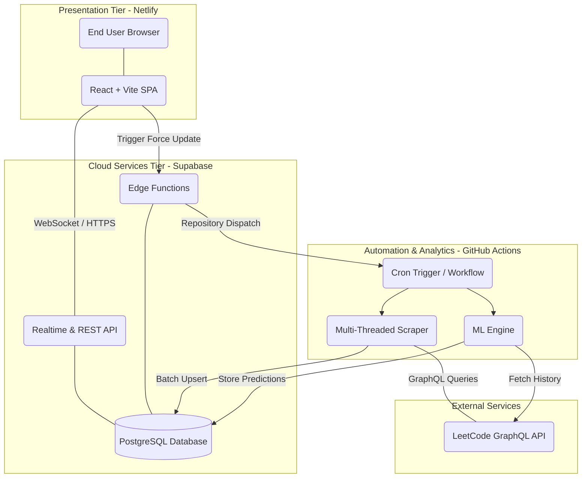
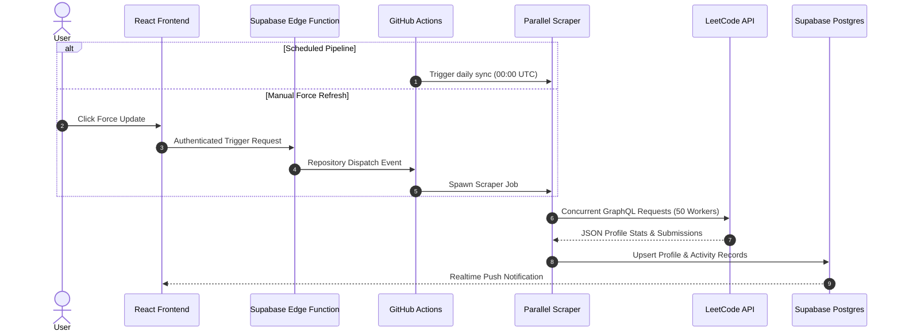
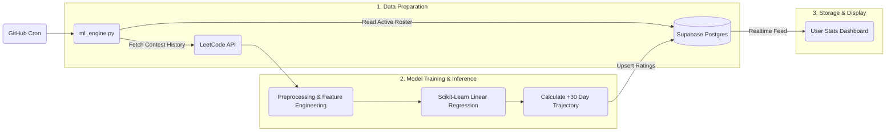

# 🏆 LeetCode Leaderboards 🏆    
  


A robust, full-stack automated leaderboard system that tracks LeetCode problem-solving progress in real-time. This project integrates a **Parallel Python automation script** for data scraping with a **Supabase** backend and a high-performance **React** frontend.

---

## 🚀 Live Demo
👉 **[View the Live Leaderboard](https://leetcode-leaderboards.netlify.app/)**   
⌛ **[Website Status](https://leetcode-leaderboards-status.betteruptime.com/)**   
---

## ✨ Key Features

### 🎨 **Frontend Experience**
* **🥇 Dynamic Rank System:** Top 3 players are highlighted with Gold, Silver, and Bronze trophies.
* **🏅 Badge Support:** Automatically fetches and displays user badges (Guardian, Knight, Monthly Badges) next to names.
* **📈 Activity Graph:** Visualizes the group's total problem-solving trend over the last 21 days.
* **⚡ Instant Search:** Real-time filtering of users by name.
* **🌙 Modern Dark UI:** Fully responsive design with a custom dark theme and orange accents.

### 🛡️ **Admin & Control**
* **🔐 Secure Admin Panel:** Password-protected area to add new users directly to the live database.
* **⚡ Force Update Button:** Triggers the scraper robot **directly from the website UI**, updating stats in ~30 seconds.
* **📜 Live Activity Feed:** Logs real-time updates (e.g., *"X solved +2 questions"*) with timestamps.

### 🤖 **Automation & Performance**
* **🚀 Parallel Processing:** Python script uses `ThreadPoolExecutor` (50 workers) with HTTP connection pooling to scrape 75+ users in under 10 seconds.
* **☁️ Zero Maintenance:** GitHub Actions runs the scraper automatically every 10 minutes.

---

## 🏗️ System Architecture (Supabase-Powered)

This project leverages a highly scalable, decoupled serverless architecture centered around **Supabase**, **React**, **GitHub Actions**, and a **Scikit-Learn ML pipeline** for real-time leaderboard aggregation and predictive rating analytics.

---
### 🌐 High-Level Architecture Overview



---

### 🧱 Core Architecture Layers

| Layer | Technology | Responsibilities & Highlights |
| :--- | :--- | :--- |
| **Presentation Layer** | `React` • `Vite` • `Recharts` • `Netlify` | • Responsive real-time leaderboard dashboards<br>• Interactive submission inspector & performance graphs<br>• Live WebSocket listener for instant data updates |
| **Backend & Storage** | `Supabase` • `PostgreSQL` • `Edge Functions` | • Persistent user profiles, submission histories & activity logs<br>• Row Level Security (RLS) & REST/Realtime subscriptions<br>• Serverless proxy functions for admin triggers |
| **Data Ingestion Engine** | `Python` • `ThreadPoolExecutor` • `GraphQL` | • Concurrent worker thread pool scraping 75+ profiles in < 10 seconds<br>• Automated profile, submission detail, and badge extraction |
| **Machine Learning Pipeline** | `Python` • `Scikit-Learn` | • Contest rating trajectory forecasting (30-day projection)<br>• Automated model retraining on historical contest performance |

---

### 🔄 Data Ingestion & Sync Pipeline



---

### 🤖 Machine Learning Rating Predictor



---

## 🛠️ Tech Stack

| Component | Technology | Description |
| --- | --- | --- |
| **Frontend** | **React.js + Vite** | High-performance UI with Recharts for graphing. |
| **Backend** | **Supabase** | All-in-one backend with Postgres, Realtime, and Edge Functions. |
| **Database** | **Supabase (Postgres)** | Cloud SQL database storing all application data. |
| **Automation** | **Python (supabase-py)** | Multi-threaded ETL script for rapid scraping and data insertion. |
| **CI/CD** | **GitHub Actions** | Automated scheduling and manual trigger execution. |

---

## 📁 Project Structure

```text
Leetcode_Leaderboards/  
├── .github/  
│   ├── workflows/                # GitHub Actions workflows  
│   |   ├── assign-claim.yml  
│   |   ├── keep-alive.yml  
│   |   ├── scraper.yml  
│   |   └── unassign-stale.yml  
|   ├── dependabot.yml  
├── frontend/                     # React + Vite frontend application  
│   ├── public/                   # Static assets  
│   ├── src/                      # React UI components & styles  
│   │   ├── assets/  
│   │   ├── ActivityGraph.jsx  
│   │   ├── AdminPanel.jsx  
│   │   ├── App.css  
│   │   ├── App.jsx  
│   │   ├── Leaderboard.jsx  
│   │   ├── Stats.jsx  
│   │   ├── index.css  
│   │   ├── main.jsx  
│   │   └── style.css  
│   ├── eslint.config.js          # ESLint configuration  
│   ├── index.html                # Main HTML template  
│   ├── package-lock.json         # Frontend dependency lockfile  
│   ├── package.json              # Frontend dependencies  
│   ├── README.md                 # Frontend documentation  
│   └── vite.config.js            # Vite configuration  
├── supabase/                     # Supabase Edge Functions & Config  
│   └── functions/  
│       ├── ai-assistant/  
│       ├── hyper-api/  
│       └── sync-engine/          # The new background scraper & proxy!  
├── .env                          # Environment variables  
├── .gitignore                    # Git ignored files list  
├── CHANGELOG.md                  # Version history and patches  
├── check_models.js               # Utility script  
├── CONTRIBUTING.md               # Guidelines for contributing  
├── fix_names.js                  # Utility script  
├── fix.py                        # Python utility script  
├── followers.py                  # Python utility script  
├── LICENSE                       # Open-source license  
├── package-lock.json             # Root dependency lockfile  
├── package.json                  # Root dependencies  
├── profiles.json                 # Static profile configuration data  
├── README.md                     # Main project documentation  
├── requirements.txt              # Python dependencies  
├── SECURITY.md                   # Security policies  
├── server.js                     # Legacy Express API server  
├── update_leaderboard.py         # Python automation script  
├── ml_engine.py                  # Machine learning prediction script
└── VERSIONS.md                   # Historical version timeline  

```

---

## ⚙️ How It Works

### 1. The Parallel Scraper (`update_leaderboard.py`)

The script uses 50 parallel threads to fetch data simultaneously, reducing execution time significantly.

```python
# Parallel Execution Snippet
with ThreadPoolExecutor(max_workers=10) as executor:
    results = list(executor.map(process_user, db_users))

```

### 2. The Force Update Trigger

1️⃣ When the "Force Update" button is clicked:

2️⃣ Frontend sends a request to Backend with the Admin Password.

3️⃣ Backend validates the password and calls GitHub API.

4️⃣ GitHub Actions wakes up, runs the Python script, and updates MongoDB/Supabase.

The Frontend refreshes to show the new data.

### 🤝 How to Join

To be added to this leaderboard:
Ask an Admin to add you via the Secure Admin Panel.

(Developers) Submit a Pull Request if running a local instance.

## 👨‍💻 Author

**Harsh Bajpai Full-Stack Developer & Automation Engineer**

LinkedIn: [https://www.linkedin.com/in/harsh-bajpai1194/](https://www.linkedin.com/in/harsh-bajpai1194/)
